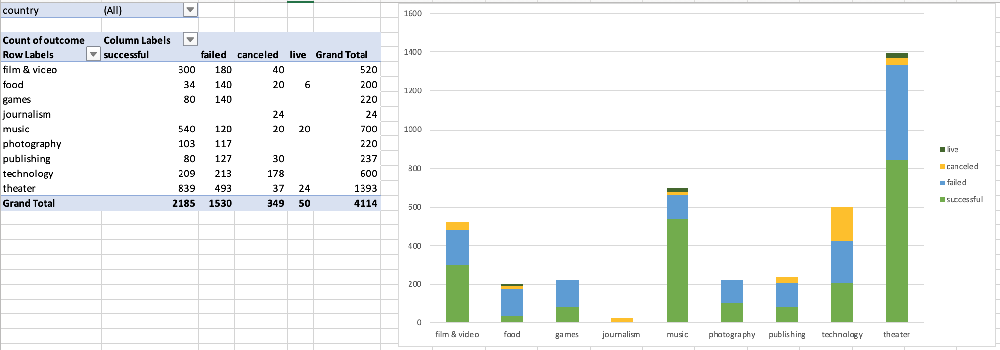

# Advanced-Excel-Analytics
Advanced Excel Analytics with Charting and Pivot Tables

## Background

Over $2 billion has been raised using the massively successful crowdfunding service, Kickstarter, but not every project has found success. Of the more than 300,000 projects launched on Kickstarter, only a third have made it through the funding process with a positive outcome.

Getting funded on Kickstarter requires meeting or exceeding the project's initial goal, so many organizations spend months looking through past projects in an attempt to discover some trick for finding success. For this week's homework, you will organize and analyze a database of 4,000 past projects in order to uncover any hidden trends.

## Objectives

Using Excel, modify and analyze the data of four thousand past Kickstarter projects in order to uncover market trends by examining funding processes and success rates.

## Conclusions

Within the data provided there are numerous conclusions that could be made about KickStarter campaigns. At first glance, KickSarter projects are 53% more likely to be successful than to fail at 37% (or get cancelled at 8%, and the remaining live).

* Category Analysis:

There is a 54% chance of success doing Kickstarter campaigns which I would place in a risk category.  The top performing categories are Music, Theater, and Film & Video have the highest success rates at 82%, 63% and 62.5% respectively. If I were to do a campaign.  It would be one of those.   While on the other end of the spectrum, food, games and publishing categories have lower success rates at 19.5%, 36% and 39%.

 
 
* Sub-Category Analysis:

  * Observing the individual sub-categories within the KickStarter campaigns we can see interesting patterns of outcomes.
Firstly, the sub-categories with 100% success rates are: classical music, documentaries, electronic music, hardware, metal, non-fiction, pop, radio & podcasts, rock, shorts, small batch, table top games and television.  There is opportunity for growth in pop, electronic, classical and metal since there were no cancelations or failures.  The top performing subcategory for Theater is plays.  The top performing subcategories for Film & Video is documentary with potentional to grow in shorts and television since they didn’t have any cancelations of failures. There is a dip in interaction from customers in Dec.  This is due to holiday spending.  I see that there is increase between the month of April and May, this could be due to people receiving bonuses and people are willing to spend more.

 * Secondly, and alternatively, sub-categories with 100% failure or cancelation rates are: animation, art books, audio, children’s books, drama, fiction, food trucks, gadgets, jazz, mobile games, nature, people, places, restaurants, science fiction, translations, videogames and web.
 
 * A conclusion about KickStarter campaign sub-categories would be that plays are the most campaigned and popular while contributing the most to theater’s highest category success rate at 83%.
  
  
## Seasonality:
* Analysis shows the highest success rate is in May at 61% across all categories while December has the lowest success rate at 44%. Notably, February and April also have comparative success rates at 60% each.

* May (halfway through Q2) success rates for all categories peak and then continue to steadily decline until September (end the of Q3), only to briefly spike back up and level out until declining sharply from November to December.

* The gap between successful and failed closes in December (actually intersecting), and failures surpass successes for the 1st time.

 
 
## Limiations

* There isn’t a lot of data to support the live category.  Also, for pivot tables and charts you have to make your own formulas and add them into the tables.  It would be good to know if short or long blurbs lead to more successful states.

* The dataset is not large enough therefore the sample size could also be a limitation. Without knowing that, we cannot be sure it is a representative size.

* Because the business model, planning, incentives to pledge, project design or marketing cannot be easily quantified we are not sure if any of those factors could have improved the success rate. A comment section or testimonials on each project could have offered better insights to predict success or if it is statistically relevant.

## Oberservations 
*  Drilling deeper into certain data points it would be interesting to see, within countries, the outcome trends by state, region or etc. This would allow us to observe which geographical areas have the highest rates of success and which ones have the lowest rate of success and possibly gather trends.

* There is more variability in successful campaigns because there was a big range between, the min: 1, max: 26,457, mean: 194, variance: 712841, and standard dev: 844.  The variance is really spread out from the mean and from one another. A high standard deviation indicates that the data points are spread out over a large range of values.

* It would be good to see who or what determined why the goal amount was set the way it was as well as the duration of the campaign (i.e. launch vs. deadline). It is highly likely that KickStarter campaigns would be more successful with a smaller goal amount and longer campaign duration, or even launching at a time of year that is more favorable to that category/sub-category.

* It would also be interesting to discover what happened to those companies/campaigns after KickStarter. Success in one arena does not mean overall continued or lasting success.

  
